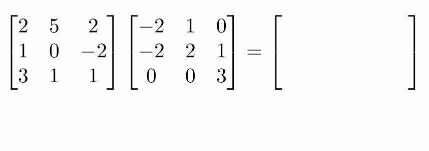

### Building Standard (Naive) Matrix Multiplication

#### The Function Signature & Inputs:

**Mathematical foundation**:  
The objective is to compute the product between two given matrices:

- Let $A$ be a matrix with dimensions $N \times M$ ($N$ rows, $M$ columns).
- Let $B$ be a matrix with dimensions $M \times P$ ($M$ rows, $P$ columns).

The resulting product, matrix $C$, is defined as:  
$AB = C$, where $C$ has dimensions $N \times P$ and  
$C \in \mathbb{R}^{N \times P}$.

Matrix multiplication is only defined when the number of columns in matrix $A$ matches the number of rows in matrix $B$.  
That is:  
$M_{\text{A columns}} = M_{\text{B rows}}$

Each element in matrix $C$ is computed as:

$$
c_{ij} = \sum_{k=1}^{M} a_{ik} \cdot b_{kj}
$$

Where:
- $c_{ij}$ is the element in the $i$-th row and $j$-th column of matrix $C$.
- $a_{ik}$ is the element in the $i$-th row and $k$-th column of matrix $A$.
- $b_{kj}$ is the element in the $k$-th row and $j$-th column of matrix $B$.
- $k$ is the summation index, iterating from $1$ to $M$.

This means:
- For each $k$ from $1$ to $M$:
  - Multiply the $k$-th element of the $i$-th row of matrix $A$ with the $k$-th element of the $j$-th column of matrix $B$.
  - Sum those products to get $c_{ij}$.

#### Visualization of the Naive Algorithm

